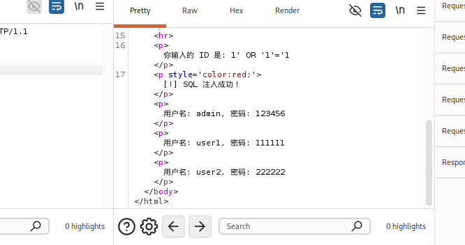
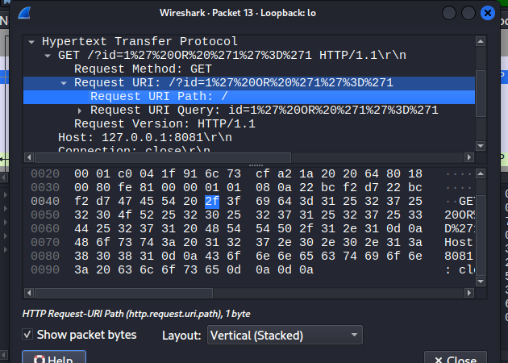

# 本地 SQL 注入靶场分析报告

## 项目描述
本项目使用 Python 搭建了一个模拟的 SQL 注入靶场，并使用 Burp Suite 和 Wireshark 对该靶场进行安全测试与分析。

## 技术栈
- Python 3
- Burp Suite
- Wireshark
- Linux (Kali)

## 攻击过程
1. 使用 Python 编写并启动了一个监听在 `8081` 端口的 HTTP 服务器。
2. 通过 Burp Suite 的 Repeater 功能，构造并发送了包含 SQL 注入 Payload 的 HTTP 请求。
3. 成功触发了靶场的漏洞，在响应中提取到了所有模拟用户的敏感信息。
4. 使用 Wireshark 捕获了此次攻击的 HTTP 流量。

## 关键成果截图
- 
- 

## 如何复现
1. 在终端运行：`python3 sqli_server.py`
2. 在 Burp Suite 中，访问 `http://127.0.0.1:8081`（或使用 Repeater 发送请求）。
3. 在输入框中输入 `1' OR '1'='1`（或直接在 Repeater 中使用编码后的 Payload）。

## 总结
- 成功搭建本地靶场并复现 SQL 注入漏洞。
- 熟练使用 Burp Suite 进行请求拦截、修改和重放。
- 熟练使用 Wireshark 抓取并分析 HTTP 流量。